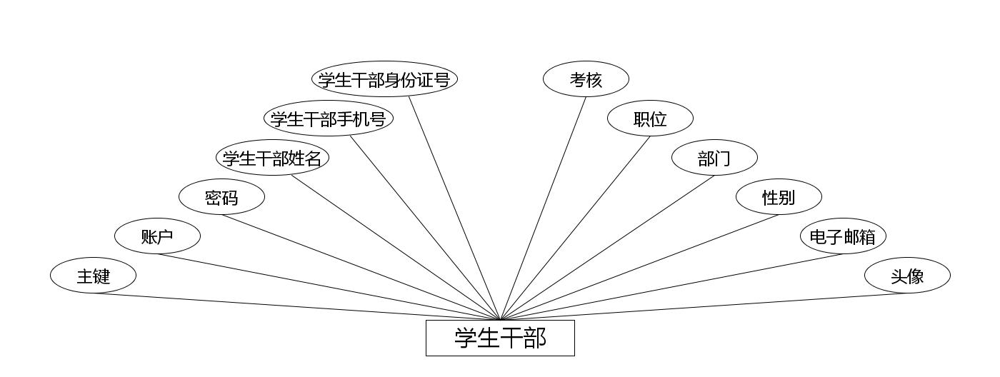
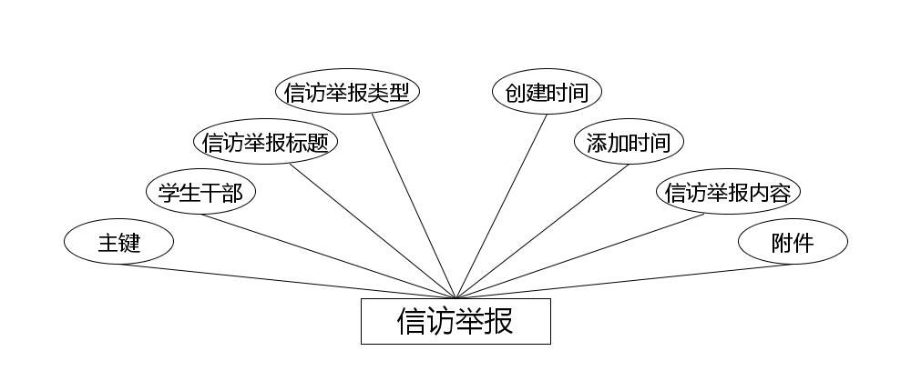
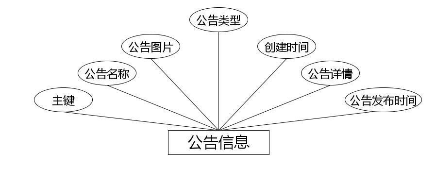
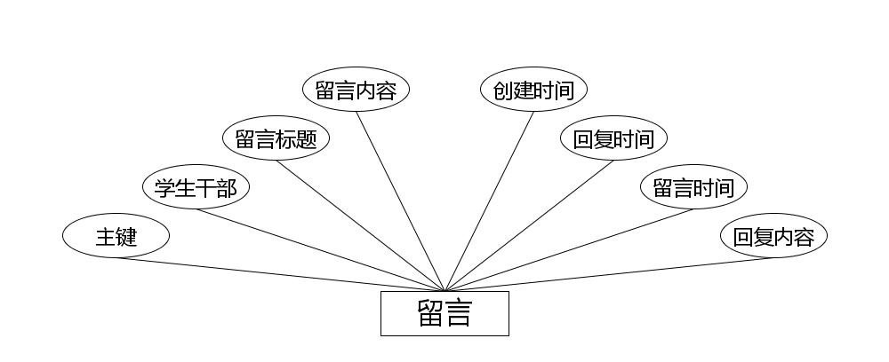
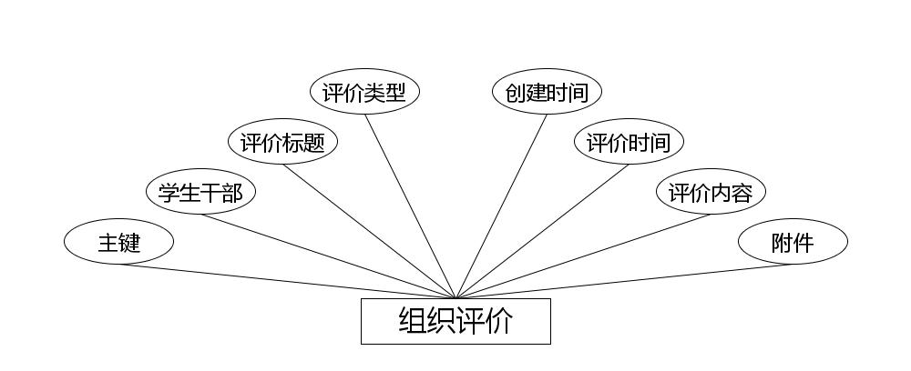
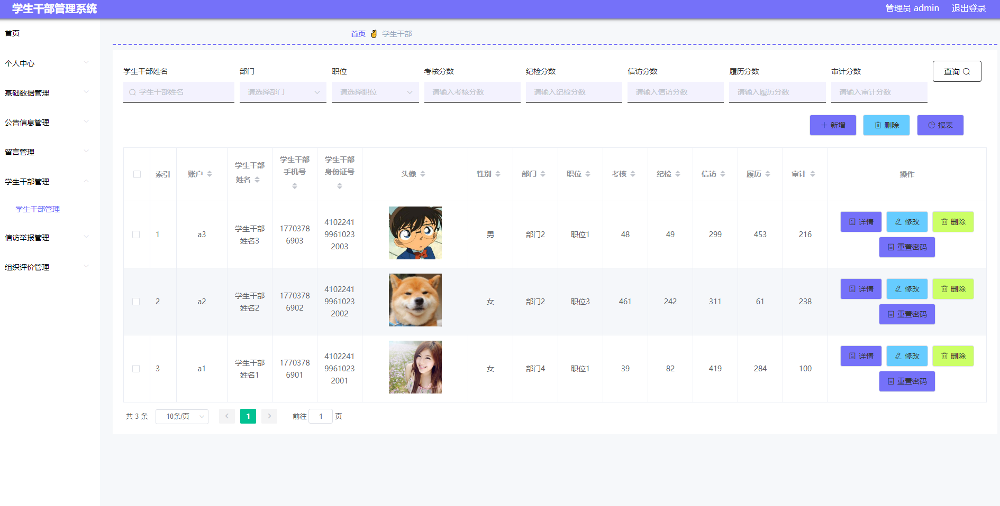
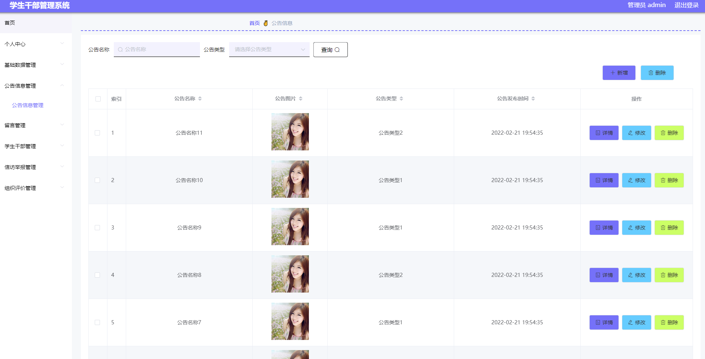

**项目简介：**  
本项目基于主流的前后端分离架构，采用 **SpringBoot + Vue 技术栈**，配套 **MySQL 数据库**，适用于毕业设计与课题实训开发。  
本人已整理了超 **4000 多套毕业设计源码+论文+开题报告+PPT...**，涵盖 **Java、SpringBoot、Vue、SSM、uni-app 小程序、PHP、Android** 等方向，支持功能修改定制与论文服务。  
**团队提供以下服务：**  
- 项目代码修改与调试  
- 数据库配置与远程协助  
- 论文定制与修改  
**获取更多的4000多套源码或SQL文件请联系：**  
- QQ：3906443360 微信：BesheHelp

# springboot152基于springboot的的学生干部管理系统

## 第4章 系统设计

4.1 系统设计的原则

在系统设计过程中，也需要遵循相应的设计原则，这些设计原则可以帮助设计者在短时间内设计出符合设计规范的设计方案。设计原则主要有可靠性，安全性，可定制化，可扩展性，可维护性，可升级性以及客户体验等原则。下面就对这些原则进行简要阐述。

可靠性：一个软件是否可靠决定了其是否被用户使用，设计不可靠的软件，用户很容易就遗弃；

安全性：程序软件承担了信息的保存与管理等事务，安全性不足的软件会导致使用者承担巨大的损失；所以系统安全也是需要考虑进入的；

可定制化：市场环境从来都不是一直固定不变，面对客户群体的改变，以及使用环境的改变，市场需求的改变等因素，程序软件也要易于调整以适应各种变化；

可扩展性：程序软件在运行使用期间，也需要及时引进当下的新技术来进行系统优化，主要就是在系统功能层面，系统性能层面上进行相应的扩展，只有这样才能让系统在实际生活中继续占有市场；

可维护性：程序软件的维护需要一定量的资金，不管是排除现有程序错误，还是变更软件的现有需求，都需要在软件技术上投入一定资金，所以易于维护的软件程序就可以降低技术层面的资金消耗；

可升级性：程序软件的投入使用，会面临用户数量增多的情况，用户对软件的使用率也会提升，所以系统面临这种情况，仍然需要通过升级保持性能的合理，这样才能够适应市场；

客户体验：设计出来的程序软件在界面上不能够太复杂，要遵循界面设计的原理设计出简单，方便操作的功能操作界面，让用户易于接受软件，并乐于使用软件提供的功能。

4.2 系统结构设计

在系统结构设计上，经综合考虑还是选择比C/S更省资金的B/S结构模式，现如今浏览器已经实现了普及，并在技术上逐渐完善和成熟，它在节约软件开发成本的基础上，还能实现原本用专业软件操作才能实现的强大功能。总之，B/S结构是当下全新的，认可度高的系统构造技术。系统结构设计图通过绘制，效果展示如下：

图4-1 系统结构设计图

4.3功能结构设计

在管理员功能模块确定下来的基础上，对管理员各个功能进行设计，确定管理员功能的详细模块。绘制的管理员功能结构见下图。

图4.3 管理员功能结构图

4.4 数据库设计

开发一个系统也需要提前设计数据库。这里的数据库是相关数据的集合，存储在一起的这些数据也是按照一定的组织方式进行的。目前，数据库能够服务于多种应用程序，则是源于它存储方式最佳，具备数据冗余率低的优势。虽然数据库为程序提供信息存储服务，但它与程序之间也可以保持较高的独立性。总而言之，数据库经历了很长一段时间的发展，从最初的不为人知，到现在的人尽皆知，其相关技术也越发成熟，同时也拥有着坚实的理论基础。

4.4.1 数据库概念设计

这部分内容需要借助数据库关系图来完成，也需要使用专门绘制数据库关系图的工具，比如Visio工具就可以设计E-R图（数据库关系图）。设计数据库，也需要按照设计的流程进行，首先还是要根据需求完成实体的确定，分析实体具有的特征，还有对实体间的关联关系进行确定。最后才是使用E-R模型的表示方法，绘制本系统的E-R图。不管是使用亿图软件，还是Visio工具，对于E-R模型的表示符号都一样，通常矩形代表实体，实体间存在的关系用菱形符号表示，实体的属性也就是实体的特征用符号椭圆表示。最后使用直线将矩形，菱形和椭圆等符号连接起来。接下来就开始对本系统的E-R图进行绘制。

（1）下图是学生干部实体和其具备的属性。

图4.1 学生干部实体属性图

（2）下图是信访举报实体和其具备的属性。

图4.2 信访举报实体属性图

（3）下图是公告信息实体和其具备的属性。

图4.3 公告信息实体属性图

（4）下图是留言实体和其具备的属性。

图4.4 留言实体属性图

（5）下图是组织评价实体和其具备的属性。

图4.5 组织评价实体属性图

（

4.4.2 数据库表结构

在进行这部分设计之前，需要明白和掌握数据类型以及各个数据类型的长度范围等知识，因为在一张具体的数据表中，为了方便理解，这里就举个简单的例子。比如用户信息表，这个表格的字段就是用户这个实体具备的属性，这时就需要对字段进行数据类型，以及字段长度的设置，也要设置一个主键来作为用户信息表的唯一标识。这些都是数据库表结构设计需要完成的内容。根据学生干部管理系统的功能设计以及数据库设计要求，展示该系统的数据表结构。

表4.1字典表

表4.2公告信息表

表4.3留言表

表4.4信访举报表

表4.5学生干部表

表4.6组织评价表

表4.7管理员表

系统实现

系统实现这个章节的内容主要还是展示系统的功能界面设计效果，在实现系统基本功能，比如修改，比如添加，比如删除等管理功能的同时，也显示出系统各个功能的界面实现效果，该部分内容一方面与前面提到的系统分析，系统设计的内容相呼应，另一方面也是一个实际成果的展示。

5.1管理员功能实现

5.1.1 学生干部管理

此页面让管理员管理学生干部的数据，学生干部管理页面见下图。此页面主要实现学生干部的增加、修改、删除、查看的功能。

图5-1 学生干部管理页面

5.1.2 公告信息管理

公告信息管理页面提供的功能操作有：新增公告，修改公告，删除公告操作。下图就是公告信息管理页面。

图5.3 公告信息管理页面

5.1.3公告类型管理

公告类型管理页面显示所有公告类型，在此页面既可以让管理员添加新的公告信息类型，也能对已有的公告类型信息执行编辑更新，失效的公告类型信息也能让管理员快速删除。下图就是公告类型管理页面。

图5.4 公告类型列表页面

